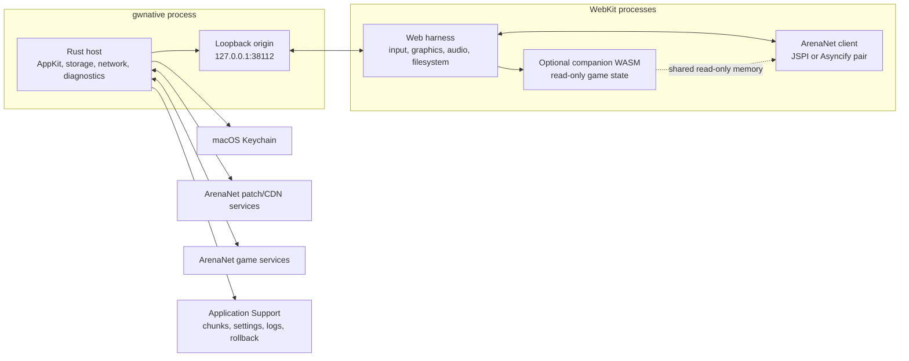

# Architecture

gwnative is a native host around ArenaNet's generated Guild Wars WebAssembly
client. It deliberately keeps generated client code in a browser realm and
implements the operating-system boundary in Rust.

## System boundaries

ArenaNet regenerates `Gw.jspi.js` with every client patch. That glue expects a
browser implementation of JSPI, WebGL, Web Audio, IndexedDB, DOM events, and the
Emscripten runtime. Replacing it with a native WebAssembly runtime would require
reimplementing those contracts and tracking every generated change. WKWebView
is therefore a compatibility boundary, not a general application framework.

Rust owns patching, chunk storage, outbound network policy, socket bridges,
credentials, windowing, diagnostics, updates, and release integration.
JavaScript is limited to the code that must share the client's realm: graphics
and audio import patches, filesystem compatibility, input translation, the
launcher, settings UI, and metrics.

## Boot sequence

`src/main.rs` orders launch phases by dependency:

1. Parse the command, native options, and Guild Wars compatibility switches
   before opening anything.
2. Select or create the profile.
3. Acquire the profile lock and, for a primary launch, the global instance
   lock.
4. Select and prepare a writable profile web root.
5. Acquire the shared-cache lease. The exclusive first user migrates the legacy
   cache, consumes a pending clear, sweeps abandoned writes, and prunes only
   chunks outside the union of every profile's valid active and rollback
   manifests, independent of patch-service root; it then
   downgrades before network or client installation work.
6. Check whether the current code-signing identity can use the profile's
   Keychain item.
7. Load a pending patch offer when one exists, otherwise load the active
   manifest. Explicit sync fetches a fresh pending offer.
8. For launches and client syncs, recover a failed optional transform or
   previously attempted unproven client, verify installed artifacts, and
   promote missing or newer artifacts with their matching manifest. Game-data
   repair does not alter the client.
9. Open the chunk store under the retained shared lease, replay the boot
   prefetch list, and start cursor-based readahead.
10. Capacity-check before the first write, then complete a requested local-image
   import, or verify and fill a requested full image or repair operation.
11. Start diagnostics and load profile settings.
12. Prepare certified WebAssembly transforms when available.
13. Start the loopback origin and inject its browser and game-state publisher
    capabilities, current keyboard layout, settings, update capabilities, and
    module state at document start.
14. Create the WKWebView, window, menu, native event bridges, renderer recovery,
    and application lifecycle delegate.
15. Record renderer/runtime viability and seal the boot chunk list when the
    page reports its first frame. Promote the generation and retire its rollback
    predecessor only after an allowed ArenaNet gameplay socket for that exact
    launch is also accepted. A numeric game endpoint counts only when this
    process previously obtained it through its allowlisted name resolver.

The `sync` command exits after artifact installation unless full-image work was
also requested. `repair` verifies and fills game-image chunks without changing
the client. Both exit before a window is created. The `serve` command stops
after the loopback starts and prints only `<address>` on stdout. A supervising
tool must request capabilities through the anonymous inherited control pipe
described below; tokens never share stdout or stderr with diagnostics.

## Loopback origin and trust model

The page is served from HTTP loopback instead of a custom WebKit scheme:

- loopback is a trustworthy secure context;
- COOP and COEP make it cross-origin isolated;
- IndexedDB works normally; and
- `performance.now()` retains sub-millisecond resolution, which the per-frame
  telemetry needs.

The listener binds only `127.0.0.1`. Port `38112` is fixed because WebKit keys
IndexedDB by origin, including the port. If the port is unavailable, an
ephemeral fallback keeps the app launchable but temporarily presents an empty
page-data origin.

Loopback is machine-local, not user-private. Host capability routes beginning
with `__` therefore require fresh random tokens with disjoint authority:

- the browser token controls credentials, settings, sockets, diagnostics, and
  process operations;
- a read-only game-state token can only `GET /__game/v1` and
  `GET /__game/v1/state`; and
- an injection-only publisher token can only `PUT /__game/v1/state`.

The browser and publisher tokens are injected through `WKUserScript`; the
reader token is never injected or served. An explicit supervisor can create an
anonymous pipe, pass only its write descriptor in `GWNATIVE_CONTROL_FD`, and
inherit that descriptor into the child. The host validates the descriptor
before opening anything else, writes `browser`, `game-reader`, and
`launch-nonce` records, then closes its end. `scripts/benchmark` is the reference
implementation. No environment variable contains a token, and no diagnostic
print escape exists. The game-state shell performs no memory observation itself
and exposes no product action capability.

Content requests are intentionally not token-gated because the generated client
cannot attach a custom header. Their authority is narrow instead:

- static paths are resolved beneath the configured web root;
- the derived module is mapped to the original module's filename;
- snapshot requests require a bounded byte range;
- HTTP forwarding uses a closed route-to-host table; and
- game sockets permit only ArenaNet/Guild Wars domain suffixes, ports 6112, 80,
  and 443, and public-unicast destination addresses.

This blocks loopback, private networks, link-local services, multicast, IPv4
addresses disguised as IPv6, and unrecognised names.

Every host response carries a content-security policy, COOP/COEP/CORP, and
`nosniff`. The policy allows the Emscripten requirements (`unsafe-eval`,
`wasm-unsafe-eval`, and blob workers) but denies objects, frames, base URL
changes, forms, and off-origin resource loads. A navigation delegate rejects
top-level navigation away from the exact loopback origin.

## Profile boundaries

The default profile preserves the original support directory, Keychain account,
and port. A named profile moves mutable support files below `profiles/<id>`,
uses `login:<id>` in Keychain, and receives a deterministic loopback port.
Because WebKit keys IndexedDB and local storage by origin, the stable port also
isolates page data, overlays, and the build library.

Content-addressed snapshot chunks remain shared. Chunk pruning retains the
union of each profile's valid active and rollback manifests, including
manifests recorded under another patch-service root, so an older installed
profile generation is not evicted by a newer one. A second instance
bypasses only the global primary lock and requires an explicit non-default
profile. Its profile lock is still mandatory, preventing an accidental pair of
writers to the same settings, window, and page origin. See
[Profiles](profiles.md) for the storage map.

## Client artifacts and generation rollback

The patch manifest describes the official client files and the chunked game
image. gwnative keeps an active manifest paired with the installed client and a
separate pending offer. Revalidation writes only the pending file, moving the
network check off the window's critical path without changing the snapshot
under a running or unsuccessfully updated client.

When the official client asks the browser to reload—for example from its
stale-build Restart dialog—the navigation guard translates that into a fresh
native process. That successor refreshes the manifest synchronously before it
opens another window, so it neither reuses the launch's one-shot identity nor
races the ordinary background revalidation.

If ArenaNet changes only snapshot metadata while the five client artifacts
remain identical, the next launch promotes that pending manifest without
reinstalling or unproving the client. The generation record reconciles the new
manifest digest idempotently, including after a process exit between the
manifest rename and state update.

Artifact presence is not treated as integrity:

- each installed client artifact is recorded by length and SHA-256;
- launch checks the record and stages a complete replacement set when any
  artifact is unsound or the offered generation is newer;
- the offered generation ID is derived from manifest data before download; and
- a newly installed generation keeps its rollback predecessor until both a
  launch-bound `POST /__booted` and an accepted ArenaNet gameplay socket are
  durably recorded.

Before replacing a proven set, gwnative verifies and saves its files and active
manifest, then requires the rollback record to persist before touching live
paths. A new manifest becomes active only after the complete five-file client
set has been staged, verified and promoted.

The page records which exact runtime it is about to execute. Recovery separates
two failures:

- a transformed attempt disables only that runtime/artifact transform and
  retries the same official module; and
- only a failed unmodified attempt can restore the previous files and manifest
  and refuse the offered patch-generation ID.

Transform refusals and generation refusals are bounded. A damaged installed
copy may retry a refused generation when no alternative exists, an explicit
`sync` can retry one deliberately, and first install never deletes its only
client merely because an unrelated boot failure occurred.

First frame is deliberately only renderer/runtime evidence. It does not by
itself prove that the client can enter the service, and it never deletes the
rollback copy. The host binds the first allowed gameplay connection to the
same native launch identity, and requires a numeric endpoint to have come from
an allowlisted ArenaNet/Guild Wars DNS answer recorded by this process. Only
the conjunction of those independently observed milestones promotes the
generation.

The web runtime lifecycle module (`web/client-runtime.js`) owns attempt identity,
proof ordering, transform fallback, first-frame sealing, and runtime-failure
transition policy. The harness supplies generated-client and streaming adapters,
DOM presentation, and flush reporting through its four-operation interface;
callbacks are notifications and do not make lifecycle decisions.

## Game-image storage

The 4.2 GB snapshot is represented by roughly 16,000 content-addressed 256 KiB
chunks under `Application Support/gwnative/chunks`. The snapshot file is
virtual: the loopback server maps a requested byte range to chunk windows,
fetching missing chunks and streaming the response without assembling the full
range in memory.

Core invariants:

- a hash identifies immutable content;
- a fetched chunk is verified before an atomic rename makes it visible;
- cached bytes are hashed on first use in a session;
- wrong-size, unreadable and hash-invalid files are never resident; a failure
  to unlink one remains a hard cache failure rather than becoming completion;
- concurrent readers of the same missing hash share one fetch;
- at most 48 network fetches run concurrently;
- speculative boot, readahead, and full-download work shares a 32-permit subset
  so demand reads always have capacity;
- up to 2,048 verified chunk descriptors are held open for cheap `pread`;
- every live profile holds a shared cache lease, while migration, clear, orphan
  cleanup, and pruning require the exclusive maintenance lease; and
- pruning retains every chunk named by the union of valid cached profile active
  and rollback manifests, and removes only regular content-addressed files from
  real lowercase-hex bucket directories without following symlinks; and
- local imports and full downloads share one exact missing-byte capacity check
  before the first cache write and retain 2 GiB of volume headroom.

Quick Start records the chunks touched before first frame and replays that list
on the next launch. A built-in list covers the first launch. Readahead follows
the current read cursor. Full Game walks the entire manifest, while its progress
bar reports cache residency rather than how far the current walk has advanced.

A complete Full Game launch runs a separate integrity pass. It hashes distinct
resident chunks, discards failures, and lets the ordinary download path repair
them. An entry that cannot be read or removed is latched unusable and prevents
a successful completion report. Verification is separate from resume so every
interrupted download does not pay for a full reread.

## WebAssembly compatibility layers

ArenaNet's modules have broken or missing file routines for build templates.
`src/wasm` prepares the official JSPI and Asyncify modules independently. A
signed artifact-family certificate must match both the JavaScript and WebAssembly
SHA-256 for the selected runtime before its transform is considered:

1. append small forwarding functions;
2. locate calls by certified target and occurrence rather than byte offset;
3. use impossible negative directory descriptors as bridge markers; and
4. handle those markers in `web/template-save.js` against IDBFS.

Asyncify can change every body and add functions, types and globals, so its
anchors and output hash are separate from JSPI's. A structural verifier,
separate from the output builder, validates the resulting WebAssembly, proves
all sections other than function and code are byte-identical, checks appended
types and forwarders, proves existing bodies differ only at authorized calls,
and then asserts the runtime-specific output hash. Unknown or failed transforms
fall back to the unmodified module, preserving playability at the cost of the
compatibility feature.

Optional enhancements do not transform or call back into the game. `build.rs`
compiles `src/companion-kernel/lib.rs` directly as dependency-free `no_std`
`wasm32-unknown-unknown` code and embeds it in the host. The companion imports
only the selected client's memory, performs bounds-checked read-only pointer
traversal, and publishes fixed state and cursor blocks through a seqlock. The
page validates each snapshot before rendering it.

An imported-memory module cannot safely use linker-chosen memory addresses:
active data segments, mutable statics, and its default stack would all overlap
the client. The build rejects any companion data segment or start function.
The page allocates private state and a 64 KiB stack through the client's
allocator, relocates the exported mutable stack pointer before the first
companion call, and passes the state pointer explicitly on every observation.

JavaScript drives the observer from its own animation frame. JSPI can be read
directly. Asyncify is read only while its generated `asyncify_get_state` export
reports Normal (0); Unwinding and Rewinding are skipped, and the companion has
no game import through which it could resume or re-enter the instrumented call
graph.

The complete transaction and fallback state model is in
[Client compatibility mechanism](client-compatibility.md). The certificate
feed, fast ArenaNet patch workflow, signing boundary and operator runbook are
detailed in [Client build certification](certification.md).

## WebKit and native integration

WKWebView lacks several Chromium APIs the client assumes:

- keyboard layout comes from Carbon's `UCKeyTranslate`;
- macOS double-clicks can be translated into the client's touch path;
- mouse focus and application focus are pushed from AppKit;
- graphics imports bridge OffscreenCanvas output to the visible canvas;
- an app-owned sibling above WKWebView retains the last complete native
  snapshot until the next logical presentation has reached WebKit's updated
  snapshot;
- the host constructs and monitors the client's AudioContext; and
- filesystem sync is pulled during application termination.

WebKit preferences that cap high-refresh rendering or suppress hidden content
are disabled by guarded feature-key lookup. Until first frame, the harness also
races `requestAnimationFrame` with a 16 ms timer so an occluded boot continues
to drive client work. After first frame the native frame callback is restored;
game animation and audio retain WebKit's normal timing.

The renderer guard starts one fresh app process if WebKit terminates the content
process. A successor marker bounds that automatic recovery across processes.
The window layer validates persisted geometry against current display work
areas, restores mode separately from the normal frame, and reports the active
display's refresh-rate ceiling.

## Diagnostics

Three producers share one JSONL clock:

- a host sampler records physical footprint, resident memory, CPU time, chunk
  statistics, and registered metrics;
- the page posts count, gauge, and peak buckets to `__diag`; and
- console and unhandled-error lines are batched through `__report`.

Records have `session`, `sample`, `page`, or `mark` kinds. Metric names, page
line counts, line lengths, and file rotation are bounded. The problem-report
layer adds environment and settings, selects the tail of the log, and redacts
email-shaped text.

See the [performance guide](performance.md) for measurement semantics and
[rendering diagnostics](rendering-diagnostics.md) for the JSPI/Asyncify frame
suspension model and reproduction matrix.

## Module map

| Area | Primary paths |
| --- | --- |
| Launch and lifecycle | `src/main.rs`, `src/cli.rs`, `src/app.rs`, `src/instance.rs`, `src/relaunch.rs` |
| AppKit and WebKit | `src/window/`, `src/webview.rs`, `src/renderer.rs`, `src/activation_cover.rs`, `src/menu/`, `src/commands.rs`, `src/layout.rs` |
| HTTP origin | `src/server/`, `src/http/`, `src/proxy.rs`, `src/ws.rs` |
| Network bridges | `src/net.rs`, `src/sockets.rs`, `src/transport.rs` |
| Patching and generations | `src/patch.rs`, `src/manifest.rs`, `src/generation.rs` |
| Snapshot cache | `src/chunks/`, `src/cache.rs`, `src/disk.rs`, `src/qos.rs` |
| Credentials and settings | `src/keychain.rs`, `src/settings.rs`, `src/paths.rs` |
| WebAssembly transforms | `src/wasm/`, `src/companion-kernel/lib.rs`, `build.rs` |
| Diagnostics | `src/diagnostics.rs`, `src/report.rs`, `web/diagnostics.js`, `web/memory.js` |
| Web runtime lifecycle | `web/client-runtime.js` |
| Web harness | `web/harness.js`, `web/graphics.js`, `web/audio.js`, `web/filesystem.js`, `web/input.js` |
| Player UI | `web/launcher.js`, `web/settings-panel.js`, `web/guide.js`, `web/loading.js` |
| Packaging and release | `packaging/`, `scripts/bundle`, `scripts/release`, `scripts/publish`, `scripts/appcast` |

## Platform risks

- The deployment floor is macOS 15.2, but WebKit behaviour is verified on newer
  releases and can change independently of this binary.
- Hidden-page and high-refresh behaviour relies on guarded WebKit feature keys.
  Missing keys degrade to WebKit defaults and are logged.
- Client transforms are intentionally pinned to exact module hashes. A new
  ArenaNet artifact pair can temporarily disable templates and tools without preventing
  launch.
- Development and packaged builds use separate WebKit storage roots.
- The loopback port fallback changes the page origin for that session.
