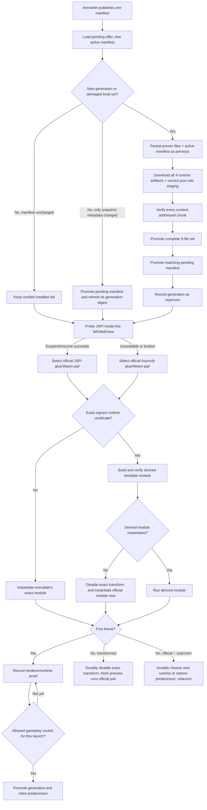
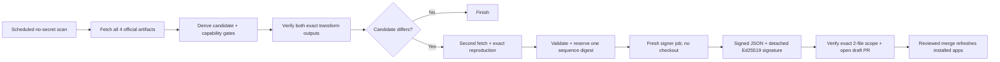

# Client compatibility mechanism

This document is the review model for keeping Guild Wars playable when ArenaNet
publishes a new web client. It covers the complete path from patch discovery to
first frame and an accepted gameplay connection, including crash recovery, JSPI/Asyncify selection, optional
transforms, signed certificates, and the exact points where gwnative falls back.

The governing rule is:

> Official ArenaNet client files are the availability path. Certification may
> enable optional features, but it may never be required to start the game.

## Support evidence contract

[`support-matrix.json`](../support-matrix.json) is the machine-readable contract
for Train A platform, runtime, rendering, fallback, offline, update, and
rollback evidence. Its validator rejects missing cells, invented hosted runner
labels, and pass claims without recorded evidence.

The current official GitHub-hosted Apple Silicon inventory covers `macos-15`
and `macos-26`. CI uses both: macOS 15 exercises the deployment floor with
forced Asyncify, while macOS 26 exercises automatic selection and forced
Asyncify, including direct and isolated rendering where applicable. GitHub
does not currently publish a `macos-27` hosted image. Both macOS 27 cells
therefore remain explicitly blocked until an authorized self-hosted canary runs
automatic JSPI and forced Asyncify on the exact release commit. A release must
not infer those cells from macOS 26 results.

The canary evaluates the production `client-runtime.js` selector in a real,
nonpersistent `WKWebView`. It requires the functional suspend/resume probe to return 42,
requires automatic selection to choose JSPI, and separately requires the
forced path to choose Asyncify. This is browser-runtime evidence without an
ArenaNet client download, login, or gameplay automation.

`lastEvidence` stays `null` until the named command or workflow actually runs.
The matrix describes required proof; its presence is not itself a pass.

The [architecture guide](architecture.md) describes the rest of the
application. The [certification runbook](certification.md) describes how a new
signed certificate is reviewed and published.

## End-to-end flow

No certificate branch ends in “do not launch.” An unknown pair, invalid feed,
failed derivation, locally disabled transform, or unavailable passive layout
all converge on the selected official module.

## Identities and what they authorize

These values answer different questions and must not be substituted:

| Identity | Inputs | Purpose | Security role |
| --- | --- | --- | --- |
| Patch generation ID | Manifest names, sizes, and chunk hashes for all four runtime files plus `version.json` | Detect a newly offered install and remember a rejected install | Rollback label; not a cryptographic trust decision |
| Artifact-family ID | Assembled SHA-256 of both exact JavaScript/WebAssembly pairs | Group the two ArenaNet runtimes reviewed together | Select shared certification history |
| Runtime-compatibility ID | Runtime name, exact Wasm hash, exact glue hash, transform ABI, selected output hash | Key a local transform refusal and compatibility record | Prevent one runtime, glue revision, ABI, or corrected output inheriting another's refusal |
| Program/build values | Values reported by the running game | Diagnostics | No installation or certification authority |

The patch generation is known before download. Artifact and runtime identities
come from the assembled files after content-addressed download verification.

## Installation transaction

The active manifest is part of the installed generation. A client and a
manifest from different offers are never an accepted state.

```mermaid
stateDiagram-v2
    [*] --> GameplayProven: Existing state already gameplay-proven
    [*] --> Unproven: Existing files adopted
    GameplayProven --> Stashed: Persist exact files + active manifest + previous record
    Stashed --> GameplayProven: Download fails or process exits before mutation
    Stashed --> GameplayProven: Promotion is interrupted; next launch restores previous
    Stashed --> Unproven: Complete files + manifest promoted and recorded
    Unproven --> FrameProven: Exact launch reports POST /__booted
    FrameProven --> GameplayProven: Same launch opens allowed gameplay socket
    FrameProven --> FrameProven: No gameplay socket; predecessor retained
    Unproven --> Unproven: Transformed attempt fails; disable transform only
    Unproven --> GameplayProven: Official runtimes fail; restore predecessor and reject new ID
    Unproven --> Unproven: No previous generation exists; retain only client
```

The durable ordering is:

1. Verify that the live files still match the proven generation.
2. Copy every recorded artifact and the active manifest to `previous/`.
3. Persist `previous` in `generations/state.json`.
4. Download and verify the complete incoming set away from live paths.
5. Promote the five files, with an immediate private backup for ordinary rename
   errors.
6. Promote the pending manifest.
7. Hash the live pair and record the offered generation as unproven.

The persistent stash, not the patcher's private staging backup, is the
crash-consistency boundary. Replacement does not begin if step 3 cannot be
persisted, and a manifest that changed behind a recorded generation is never
accepted as a rollback target. On the next launch:

- if live files and manifest still match `previous`, the process died before
  mutation and the redundant stash is discarded;
- if they differ, the exact stashed artifacts and manifest are verified and
  restored before any client is read;
- if restoration cannot complete, the stash record is retained for another
  attempt and the post-failure integrity check prevents a mixed set from being
  launched.

A normal sync or manifest-activation error also restores through this verified
durable path. The record is cleared only after the whole prior pair is back.
When only snapshot metadata changes, no client artifact is replaced or
unproven: the pending manifest is promoted directly and its digest is
reconciled idempotently on the next launch if the process exits between those
two atomic writes.

## Runtime selection and fallback

Safari Technology Preview does not change an application's system WKWebView.
The JSPI decision is therefore made inside the actual game WKWebView. The probe
instantiates a tiny module, suspends through an asynchronous import, resumes a
promising export, and requires the value `42`. API presence without a working
suspend/resume round trip selects Asyncify. The probe also has a bounded
deadline, so a partial implementation that never resumes cannot hold startup.

The selected glue and Wasm always come from the same official pair:

| Probe result | Glue | Wasm |
| --- | --- | --- |
| JSPI works | `Gw.jspi.js` | `Gw.jspi.wasm` |
| JSPI does not work | `Gw.js` | `Gw.wasm` |

Before appending the selected glue, the page records the runtime, exact
runtime-compatibility ID, and whether the module is transformed. That auxiliary
loopback attempt has a 1.5-second per-request deadline and bounded identical
retries. ArenaNet glue does not execute without a durable acknowledgement;
failure stops visibly rather than losing rollback evidence.

There are three bounded fallback transitions:

1. If a derived module cannot compile or instantiate, the same launch records
   the exact transform refusal and requests the official file with
   `?gwnative-original=1`.
2. If a derived module instantiates but the launch ends before first frame, the
   host durably disables that exact transform, acknowledges with a bodyless
   status, and a fresh native process retries the same official runtime.
3. If an official JSPI launch ends before first frame, the host durably records
   that exact failure and a fresh process selects official Asyncify. Failure of
   the remaining official runtime restores the predecessor when one exists, or
   reports exhaustion without deleting the only installed client.

The page retries a lost acknowledgement only with the exact launch claim. No
runtime transition occurs in the settled or contaminated JavaScript realm.

Only an attempted official module can make an unproven ArenaNet generation
eligible for rollback. A transformed failure never rejects official files.

## Certificate and transform boundary

The signed feed is data-only. It can identify exact inputs, reviewed functions,
call sites, output hashes, and optional read-only layouts. It cannot supply
WebAssembly instructions or native code.

For each runtime, candidate generation requires:

- exact JavaScript and WebAssembly SHA-256;
- exact function-import count and carrier import;
- all five fixed bridge kinds;
- exact bridge-target function bodies;
- exact caller function bodies;
- the reviewed occurrence and total number of calls to each target; and
- the exact independently expected transformed output SHA-256.

The compiled transformer appends five fixed forwarders. A separate verifier
then validates the output as WebAssembly, proves all non-function/code sections
unchanged, proves all existing types unchanged, permits only the certified call
operands to differ, verifies every appended type/body, and checks the pinned
output hash.

A later certificate wins for an exact runtime pair reused across artifact
families. This permits a signed correction without an app release. The
runtime-compatibility ID includes its output hash, so the corrected certificate
does not inherit a local refusal of the older result.

## Passive enhancement boundary

The native cursor and target readout are separate from the template transform.
Target readout uses the most recent signed passive-layout proof. Cursor-only
support may use a separately release-reviewed exact-pair certificate, with its
own layout and feature mask; it still requires matching data, element, and
global-prefix proofs plus live cursor validation. Agreement between two newly
produced runtimes alone is not enough to bless changed offsets. See
`docs/cursor-compatibility.md`.

The companion:

- imports only the selected client's memory;
- has no game-function import, start function, mutable static, or data segment;
- uses a private state region and 64 KiB stack allocated by the game;
- bounds-checks every pointer traversal;
- writes only to its allocated snapshot regions; and
- is called from a page-owned animation frame, never from the game call graph.

JSPI needs no suspension gate. Asyncify must export
`asyncify_get_state`; a missing export disables the optional observer rather
than being mistaken for JSPI. The state must be Normal (`0`) before and after
each observation. Unwinding (`1`), Rewinding (`2`), a trap, or an unknown state
skips or permanently stops the observer without stopping the game.

## Signed publication flow

The private key is available only to the main-only signer job. Candidate jobs
compile repository code but receive no secret. A no-secret writer reserves one
candidate digest on a canonical per-sequence ref before the signer receives the
validated JSON and checks that its private key derives the compiled public key.
The no-secret publisher verifies the signed pair, consecutive sequence, and
exact two-file commit before opening a draft PR. Reservation refs must reject
deletion and non-fast-forward updates; an identical later poll safely resumes.

## Failure outcome matrix

| Failure | Immediate result | Persistent result |
| --- | --- | --- |
| Manifest refresh unavailable | Launch verified installed client | Retry a later refresh |
| New certificate unavailable or invalid | Launch official module | Use bundled valid feed |
| Unknown exact runtime pair | Launch official module | Optional features remain uncertified |
| Candidate semantic anchor changed | Do not sign | Tracking issue; players use official module |
| Derived build or verification fails | Launch official module | Optional features report failed |
| Derived instantiate fails | Retry official module in same launch | Disable exact transform |
| Transformed launch reaches no frame | Persist exact refusal; start fresh process | Run the same official runtime without that transform |
| Official JSPI launch reaches no frame | Persist failure; start fresh process | Try official Asyncify |
| All official modes for an unproven launch fail | Keep current files until durable transition | Restore previous pair and reject generation |
| First frame but no gameplay socket | Keep running and keep rollback copy | Do not promote or retire predecessor |
| First frame plus bound gameplay socket | Continue the game | Promote generation and retire predecessor |
| First install reaches no frame | Retain only available client | Retry; nothing is deleted |
| Sync fails before mutation | Restore/verify prior pair | Clear redundant stash |
| Process exits during promotion | Stop with durable stash present | Restore prior pair before next read |
| Passive observer ABI/layout mismatch | Do not install observer | Game and template path continue |
| Asyncify is unwinding/rewinding | Skip observation | Retry only in a later Normal frame |

## Audit workflow

Review compatibility changes in this order:

1. Diff inventory: account for every changed patch, generation, Wasm, server,
   page, workflow, script, and documentation file.
2. Installation proof: trace active/pending manifests, staging, promotion,
   process interruption, restoration, record, first-frame proof, bound gameplay
   proof, predecessor retirement, rejection, and explicit retry.
3. Runtime proof: trace the functional JSPI probe, exact pair selection,
   injected per-runtime facts, derived/original serving, same-launch fallback,
   fresh-process fallback, exact lost-ack retry, and first-frame report.
4. Transform proof: check input/glue identities, caller and target anchors,
   authorized mutation set, output validation/hash, cache stamp, and newest
   exact certificate selection.
5. Passive proof: check exact layout selection, companion imports/exports,
   memory regions, stack relocation, Asyncify Normal-state gate, traps, and
   teardown.
6. Publication proof: check action pinning, token permissions, two independent
   artifact fetches, identity reproduction, protected environment, key/public
   match, detached verification, certificate-only diff, and PR creation.
7. Availability proof: for every failure above, identify the branch that still
   serves an official module or a previously proven generation.
8. Regression and platform proof: run the complete Rust/JavaScript suite,
   formatting, Clippy, docs/scripts/actionlint/dependency policy, release build,
   bundle, exact external artifact transforms, candidate generation, and both
   runtime paths on the M1 runner.

Critical invariants have named regressions:

| Invariant | Regression |
| --- | --- |
| Both official runtime pairs are installed | `patch::tests::installs_both_official_runtime_pairs` |
| Active manifest stays paired until promotion | `patch::tests::a_pending_offer_does_not_replace_the_active_manifest_until_activation` |
| Snapshot-only metadata updates do not reinstall or unprove the client | `tests::unchanged_client_artifacts_activate_pending_snapshot_metadata` |
| Partial promotion restores the live set | `patch::tests::a_failed_promotion_restores_the_whole_live_set` |
| Interrupted download clears only a redundant stash | `generation::tests::an_interrupted_download_discards_the_redundant_stash_on_next_launch` |
| Interrupted promotion restores exact files and manifest | `generation::tests::an_interrupted_promotion_restores_the_entry_generation` |
| Interrupted repair of an unproven set restores its proven predecessor | `generation::tests::an_interrupted_repair_of_an_unproven_set_restores_the_proven_predecessor` |
| Corrupt bytes cannot become a rollback target | `generation::tests::corrupted_live_bytes_are_never_saved_as_a_rollback_target` |
| Changed manifests cannot become rollback targets | `generation::tests::a_changed_manifest_is_never_saved_as_a_rollback_target` |
| An undurable stash cannot authorize replacement | `generation::tests::a_stash_is_not_armed_without_a_durable_record` |
| A manifest-activation crash is reconciled on the next launch | `generation::tests::an_active_manifest_update_is_reconciled_without_rehashing_the_client` |
| Old generation records migrate safely | `generation::tests::a_pre_manifest_record_can_still_be_stashed_safely` |
| Transform failure does not reject official files | `generation::tests::a_failed_transform_is_disabled_without_rolling_back_official_files` |
| Official fallback bytes remain addressable | `server::tests::a_failed_transform_can_request_the_exact_official_module` |
| Runtime state is gated and validated | `server::tests::runtime_fallback_state_is_token_gated_and_strictly_validated` |
| Runtime-state persistence cannot hold startup | `client-runtime.test.js` — “does not let runtime-state persistence hold client startup” |
| JSPI requires a functional suspended round trip | `client-runtime.test.js` — “uses JSPI only after a functional suspend/resume round trip” |
| A stuck JSPI probe falls back within its deadline | `client-runtime.test.js` — “falls back when a partial JSPI implementation never resumes” |
| A changed caller at a reused function index is rejected | `wasm::rewrite::tests::candidate_generation_rejects_a_reused_index_with_a_changed_caller` |
| Latest correction wins for reused exact artifacts | `wasm::certificate::tests::the_newest_certificate_wins_for_a_reused_exact_runtime_pair` |
| Asyncify cannot lose its state gate silently | `enhancements.test.js` — “does not mistake a missing Asyncify state export for JSPI” |
| Exact official artifacts reproduce both pinned outputs | `wasm::tests::external_official_pairs_produce_valid_candidates` |
