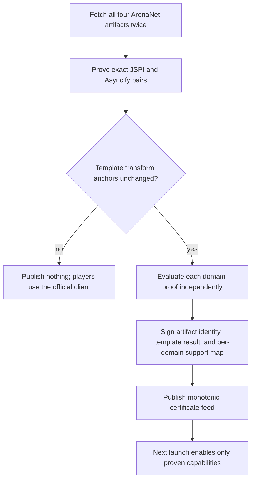

# Game API capability architecture

This document defines the target architecture and merge order for gwnative's
optional read-only game API. It is deliberately separate from the client
template transform: an unknown ArenaNet build must remain playable even when
no optional state capability can be enabled.

## Design goals

- Keep ArenaNet's JSPI and Asyncify clients unmodified when an optional
  capability cannot be proven.
- Fail one state domain independently instead of disabling every optional
  tool when one layout changes.
- Do no memory traversal, publication, or JavaScript decoding for a domain
  that has no active consumer.
- Keep companion code passive: it may read certified memory and write only to
  host-allocated private blocks.
- Keep public product routes read-only. The launcher’s private login and
  preferred-character startup bridges are narrow, separately proven exceptions;
  they grant no external control route. Other scene mutations belong to
  authenticated benchmark-only builds and routes.
- Make each merge request small enough to review, test, and revert as one
  mechanism.

The design borrows public API vocabulary and pure algorithms only where their
licenses permit it. Native GWCA/GWToolbox hooking, scanning, Direct3D, and
manager code is not a browser runtime and is not imported.

The historical companion kernel and parts of the renderer, input, template,
and WebAssembly transformation code have material GPL-3.0-only GWoNmac
lineage. Parts of the renderer also descend from GPLv3 `gw_in_browser` code.
The repository therefore distributes the combined work under GPL-3.0-only,
records the affected paths and pinned upstream baselines in
[`THIRD-PARTY-NOTICES.md`](../THIRD-PARTY-NOTICES.md), and publishes the
corresponding source and build scripts with every tagged release.

GPL-3.0-or-later is not an accurate shortcut: it would grant later-version
permission that the copied GPL-3.0-only expression does not carry. Release
packaging also keeps ArenaNet client and game artifacts outside the
distribution and preserves the separate Sparkle and asset notices.

Reviewing architecture is not a clean-room rewrite, and a rewritten filename
or reorganized functions do not erase derivation.

The upstreams also do not define a portable mod ABI to inherit. The current
`gw_in_browser` tree has no `.gwmod` format or loader; GWoNmac explicitly keeps
one fixed passive companion and no generic plugin loader; and GWToolbox's
`refactor/wasm-compatibility` branch remains a native C++/GWCA application. A
generic loader would therefore invent an unsigned executable format and a
second compatibility surface before there is a consumer. It is excluded from
this train. If a real interoperable format appears later, its specification,
publisher identity, runtime ABI, and recovery behavior require a separate
design and threat-model review.

## Runtime boundary

```mermaid
flowchart LR
    Cert["Signed artifact-family certificate"] --> Runtime["Exact JSPI or Asyncify artifact"]
    Runtime --> Core["Passive companion core"]
    Cert --> Registry["Capability registry"]
    Registry --> Core

    subgraph Domains["Independently proven domains"]
        D1["core: map / player / target"]
        D2["cursor"]
        D3["combat: agents / party / effects"]
        D4["inventory / economy"]
        D5["social / progression"]
        D6["quests / UI"]
    end

    Core --> Domains
    Domains --> Decode["Domain-specific validators and decoders"]
    Decode --> API["Read-only /__game/v1 capabilities"]
    API --> Tools["Opt-in tools and external consumers"]

    Bench["Authenticated benchmark-only routes"] -. "never part of product API" .-> Runtime
```

The page owns scheduling. The companion is never called from a game callback
or imported game function. JSPI may be observed directly. Asyncify may be
observed only while `asyncify_get_state()` reports Normal; Unwinding and
Rewinding skip all companion work.

## Capability contract

Preferred-character startup is outside the public game API. A session-private,
exact-build JSPI transform provides bounded roster observations and closed
selection/Play operations; Asyncify remains unsupported and manual. No roster,
selection, Play, or entered-state operation is exposed through `/__game`.
Character actions run only through the verified game callback, independently
of the passive companion. The bridge is separate from reader/publisher tokens
and grants no external game-control route. Current implementation and live
acceptance limits are recorded in [Phase 2 character capability](launcher-phase-2-character.md).

Each domain has its own descriptor rather than an offset inside one global
snapshot:

| Field | Purpose |
| --- | --- |
| capability ID and ABI version | Select an independently versioned contract |
| runtime support bit | State whether this exact JSPI or Asyncify artifact was proven |
| layout proof | Bind every traversed root, offset, container rule, and bound |
| private allocation | Prevent overlap with client memory or another domain |
| sequence and revision | Provide seqlock publication and change detection |
| requested cadence | Bound work while the domain has consumers |
| validator and decoder | Reject malformed state without affecting other domains |
| last failure | Disable and diagnose only this domain |

The host exposes a capability only after all of these checks pass:

1. the signed feed matches the exact JavaScript and WebAssembly artifacts;
2. the selected runtime has a domain layout proof;
3. the companion ABI and private allocation match the descriptor;
4. a stable seqlock read passes the domain validator; and
5. runtime invariants for that domain pass.

A failure clears only that domain's support bit and records a bounded
diagnostic. Template saving and unrelated domains continue to work. A failure
must never reject the ArenaNet client generation.

## Demand and cadence

The registry reference-counts consumers from the tools panel, internal
features, and authenticated external API sessions. A zero count means no
collection and no decoding. Polling starts on first subscription and stops on
the last unsubscribe.

Initial ceilings are deliberately conservative and may be lowered when a
published revision is unchanged:

| Domain | Maximum cadence while consumed |
| --- | --- |
| cursor | display cadence, capped at 60 Hz |
| map / player / target | 20-30 Hz |
| agents / party / effects | 10-20 Hz |
| inventory / quests / social / progression | 1-2 Hz or request-driven |

Collection should publish a new revision only when the bounded encoded value
changes. JavaScript validates and decodes only a new stable revision. A slow
consumer may skip revisions; it must not make the game wait.

Event hooks may later mark a domain dirty, but they are optional scheduling
optimizations, not correctness dependencies. Exact-build hooks increase the
certification surface and can run while the game owns sensitive control-flow
state, so periodic page-owned observation remains the fail-safe path.

## Product and benchmark separation

The installed application's game API is read-only. It may report capabilities,
validated snapshots, revisions, and bounded diagnostics. It does not move the
character, change district, select a character, submit credentials, or change
graphics settings.

End-to-end and performance automation is compiled or launched explicitly in a
benchmark mode. Its authenticated routes may perform the minimum scene-control
operations required for repeatable tests. Those routes must be absent or
return not found in a normal product launch, and credentials must continue to
enter through the native secure-input path.

## Certification workflow

JSPI and Asyncify never inherit each other's function bodies, call sites, or
output hashes. A domain may share semantic layout evidence only when both exact
artifacts independently reproduce the certified bytes and invariants. Missing
domain proof is represented as unsupported data, not inferred from a nearby
build.

The unattended publisher remains fail-closed for signing and fail-open for
playability: incompatible template anchors sign nothing, while incompatible
optional layouts sign template support with those domain bits cleared.

## Merge-request train

The historical stacked branches remain reference points. Implementation is
rebuilt into the following review units; a child is based on the preceding
unit only when it actually consumes that unit's public contract.

1. Profiles, paths, Keychain scoping, instance ownership, and shared-state
   concurrency.
2. Legacy Guild Wars CLI compatibility and its host/WebKit behavior.
3. Cache maintenance, image verification, and recovery.
4. Minimal companion core plus map/player/target read-only API.
5. Tools shell, overlay, hotkeys, and build library.
6. Authenticated E2E transport and bounded event synchronization.
7. Trusted AppKit input bridge.
8. Login, character-entry, and secure-input synchronization.
9. Per-domain ABI and capability registry.
10. Party, skillbar, and effects domain.
11. Agents, quests, and objectives domain.
12. Performance sampler and benchmark-only scene controls.
13. Passive observer demand scheduling, change-only publication, and cadence
    enforcement.

The tools shell and E2E transport are sibling branches from the companion
core. Native input and auth synchronization form a short chain from the E2E
transport. The domain ABI is also based on the companion core; it does not gain
a dependency on UI tooling or login automation. The later benchmark unit is
the first place that intentionally combines the authenticated E2E contract
with the agents/quests domain.

Inventory/economy, social/progression, and UI/camera domains follow only when a
product consumer exists. Steam authentication is rebased and manually tested
after the core train because it crosses credential and launch contracts but is
not required by the game-state API.

Each unit should normally stay below roughly 2,000 logical additions and 15
changed files. Generated fixtures may be reported separately, but they do not
justify combining unrelated mechanisms. Tests and contract documentation ship
with the unit they verify.

## Required checks

Every unit must pass the ordinary Rust, JavaScript, dependency, formatting, and
script checks. The companion and domain units additionally prove:

- source provenance and license compatibility are recorded and reviewable;
- no data segment, start function, game-function import, or unbounded read;
- private allocations are non-overlapping and overflow-checked;
- unstable seqlock reads are discarded;
- one malformed or disabled domain does not affect another;
- zero consumers produces zero domain collection and decode calls;
- Asyncify Unwinding/Rewinding produces zero companion calls;
- unknown and deliberately invalid certificates launch the official client;
- benchmark-only mutation routes are unavailable in product mode; and
- live JSPI and Asyncify smoke tests reach a first frame before any optional
  feature is considered healthy.

The crowded-scene matrix measures visible-window JSPI and Asyncify runs,
isolated and direct presentation paths, at fixed graphics settings and scene
position. Measurements are evidence for an optimization; they are not a
certificate input and cannot block ordinary play.

## Migration and rollback

Existing large pull requests are not force-rewritten while other worktrees may
depend on them. Their heads are retained as archival references. New branches
are reconstructed from reviewed commits and small clean-room adaptations, then
compared against the historical stack for missing behavior.

After a replacement unit merges, children are retargeted only if their merge
base and diff contain exactly their advertised responsibility. Merge commits
preserve ancestry during the transition. A unit can be reverted without
reverting unrelated domains, and an optional-domain rollback never changes the
installed ArenaNet artifact set.
